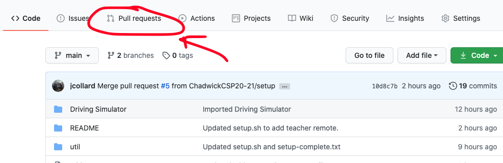

# Portfolio Revisted

## Overview

In this project, you will revisit your portfolio project and enhance it using a template of your choice. Additionally, you will begin to learn how to use JavaScript to control the elements on an HTML page to create
a Projects Gallery.

* [Setup your repository](#setup-your-repository)
  * [Sign up for the project](#sign-up-for-project)
* [Milestones](#milestones)
  * [Milestone 1](#milestone-1)
  * [Milestone 2](#milestone-2)
    * [JavaScript Basics](#javascript-basics)
  * [Milestone 3](#minestone-3)
* [Grading](#grading)
  * [Computational Thinking](#computational-thinking)
  * [Computing, Programming and Practice](#computing-programming-and-practice)
  * [Skills of a Student](#skills-of-a-student)
* [Getting Help](#getting-help)

## Setup your repository

### Sign up for Project

Sign up for the project repository here:
TODO
[https://classroom.github.com/a/Nd5l5pVc](https://classroom.github.com/a/Nd5l5pVc)

After your repository has initialized it, clone it to your computer. I recommend
putting it in your `ap-csp` directory.

After you've cloned your repository, run the `setup.sh` script in the root of
that repository to initialize it's configuration.

Upon completion it should display a message similar to this one:

```
######################################################
# SETUP IS COMPLETE. YOU SHOULD NOW CREATE A         #
# `develop` BRANCH BY RUNNING THE FOLLOWING COMMAND: #
#                                                    #
# git checkout -b develop                            #
#                                                    #
# THEN PUSH THAT BRANCH TO GITHUB BY RUNNING THE     #
# FOLLOWING COMMAND:                                 #
#                                                    #
# git push -u origin develop                         #
#                                                    #
# AFTER PUSHING, OPEN A PULL REQUEST FROM YOUR       #
# `develop`  BRANCH TO THE `main` BRANCH BY VISITING #
# THIS REPO ON GITHUB, CLICKING `Pull Requests`      #
# THEN `New pull request`. THE BASE BRANCH SHOULD BE #
# `main` and THE COMPARE BRANCH SHOULD BE `develop`. #
#                                                    #
# FINALLY, ADD YOUR INSTRUCTOR AS A REVIEWER ON      #
# GITHUB. THIS IS HOW YOUR INSTRUCTOR WILL SEE YOUR  #
# WORK.                                              #
######################################################
```

Follow the directions to create a `develop` branch as well as pushing your
`develop` branch to Github.

Finally, create a pull request from your `develop` branch to the `main` branch
and assign `jcollard` as a reviewer.




## Milestones

### Milestone 1

Due: Thursday Dec. 3rd @ 8am

For the first milestone, you will select a template from an HTML/CSS template
site to use as your new portfolio theme. Then, transfer the content of your
previous portfolio to that new theme.

Sites that offer free templates:

* [W3 Schools Templates](https://www.w3schools.com/w3css/w3css_templates.asp)
* [Template MO](https://templatemo.com/tag/portfolio)
* [Free CSS](https://www.free-css.com/template-categories/portfolio)

Of course, you are not limited to the templates from these sites. You can select
any template you want. The main goal here is to amp up your portfolio and make
it look as professional as possible.

Finally, update your projects section describing your Beach Resort project. Be
sure to talk about all of the features of the Beach Resort page, screen shots
and a link to the Beach Resort home page that allows visitors to browse throught
the page.

All code that you would like to count toward your evaluation should be part of a
`tag` on in your repository called `milestone-1`. This can be created by running
`git tag milestone-1`. Then push your tag to your repository by running `git
push -u origin milestone-1` The date of this tag creation will be used to
determine when your work was submitted. 

### Milestone 2

Due: Thursday Dec 10th @ 8 AM

Next, update the projects section of your portfolio to be an interactive
gallery. Like the one in this [VIDEO](#)

#### JavaScript Basics

To help you get started, here are several videos that will guide you through
connecting JavaScript to your pages as well as how to control your HTML content
through JavaScript

1. [Adding JavaScript to an HTML Page](#)
2. [The onload Event](#)
3. [The onclick Event](#)

All code that you would like to count toward your evaluation should be part of a
`tag` on in your repository called `milestone-2`. This can be created by running
`git tag milestone-2`. Then push your tag to your repository by running `git
push -u origin milestone-2` The date of this tag creation will be used to
determine when your work was submitted. 

### Milestone 3

Due: Monday Dec 14th @ 8 AM

Propose and implements a feature on your portfolio that utilizes JavaScript. You
should propose your idea on Piazza so others might get an idea of their own.

Example Ideas:

* Auto Scrolling Gallery
* Drop Down Menu
* A Clock or Countdown Timer

All code that you would like to count toward your evaluation should be part of a
`tag` on in your repository called `milestone-3`. This can be created by running
`git tag milestone-3`. Then push your tag to your repository by running `git
push -u origin milestone-3` The date of this tag creation will be used to
determine when your work was submitted. 


## Grading

### Computational Thinking

In this assignment, you will demonstrate your understanding of basic HTML tags
and how they interact with CSS to create a rich user experience.

| Advanced                                                                      | Proficient                                                         | Basic                                                           | Below Basic                                                                 |
|-------------------------------------------------------------------------------|--------------------------------------------------------------------|-----------------------------------------------------------------|-----------------------------------------------------------------------------|
| Completes all 7 pages                                                         | Completes at least 5 pages                                         | Student successfully completes the index.html page              | Student does not create an index.html page that matches the reference image |
| Adds hover to all sections noted in [Mouse Over CSS](#mouse-over-css) section | Completes a functional Top Navigation Bar that works on all pages  | Student creates a css file that connects to the index.html page | Little or no CSS Styling                                                    |
| Adds Social Media Links to the bottom navigation bar                          | Completes a function Bottom Navigation Bar that works on all pages |                                                                 |                                                                             |

### Computing, Programming, and Practice

This section covers how organized and readable your code is as well as your
ability to follow the commit guidelines and templates.

| Advanced                                                                               | Proficient                                                       | Basic                                                           | Below Basic                                                                    |
|----------------------------------------------------------------------------------------|------------------------------------------------------------------|-----------------------------------------------------------------|--------------------------------------------------------------------------------|
| All of the student's HTML and CSS are well indented                                    | The majority of the HTML / CSS is well formatted and indented    |                                                                 | Students code is not well formatted                                            |
| Student provides ample comments in HTML to help keep sections organized and separated. | Student provides few comments in their HTML files                | Student wrote some comments                                     | Student did not write comments                                                 |
| Student provides comments in their CSS describing their styling choices                | Student provides few comments in their CSS Files                 |                                                                 |                                                                                |
| All of the students commits follow the commit message template.                        | Most of the students commits follow the commit message template. | Some of the students commits follow the commit message template | Few or none of the students commit messages follow the commit message template |

### Skills of a Student

Your skills of a student covers your StudentLog repository, your in class time
management, meeting deadlines, asking for help when needed, and helping others
when able.

| Advanced                                                                           | Proficient                   | Basic                                                    | Below Basic                                          |
|------------------------------------------------------------------------------------|------------------------------|----------------------------------------------------------|------------------------------------------------------|
| Manages time well in class, stays focused on work  at hand at all times            | Focuses on work in class     | Focuses at times, can get distracted                     | Uses class time poorly, is frequently distracted     |
| Meets all deadlines, on or ahead of schedule                                       | Meets deadlines              | Delivers close to deadline, may be late  by a day or two | Delivers work late or not at all                     |
| Advocates for self, seeks clarification when needed  and volunteers to help others | Seeks assistance when needed | Needs prompting to seek assistance                       | Does not seek assistance or ask for help when needed |

## Getting Help

All questions should be posted to the class Piazza board. You are also
encouraged to help other students who post on Piazza. When you post your
question, be sure to include as many details as possible for reproducing the
issue you're having.

Questions you should answer when asking a question include:

1. What are you trying to do?
2. What did you try?
3. What was the result?

Work hard to make sure the person trying to answer your question can reproduce
your error. Share your files so others can run exactly what you're running.

Also, include screenshot!

Formulating good questions is a good life long skill. You should try asking your
question on Piazza before seeking out synchronous time with Mx. Collard.
However, if you would like to meet to discuss synchronously, first, look at [Mx.
Collard's Calendar](http://tinyurl.com/mx-collard-calendar), then send them an
email with at least two proposed times you would like to meet.